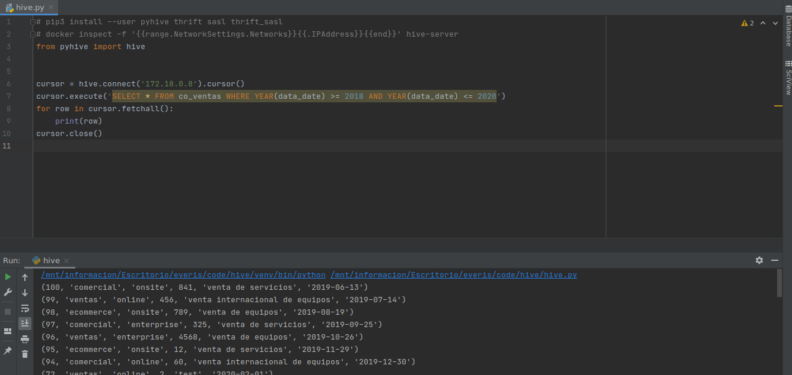

# Como ejecutar:

Para ejecutar este programa se requiere instalar las librerias (`pyhive, thrift, sasl y thrift_sasl`):

```shell
# pip3 install --user pyhive thrift sasl thrift_sasl
```

Con las librerías instaladas, es necesario modificar la Ip de `hive`, se debe poner la ip del container de `hive-server`, está última se obtiene con el siguiente comando:
```shell
docker inspect -f '{{range.NetworkSettings.Networks}}{{.IPAddress}}{{end}}' hive-server
```

Con la Ip anterior, se reemplaza en la línea 6 del [programa](hive.py).

Con los cambios anteriores, el programa debería correr sin problemas.

Los resultados del programa son:



