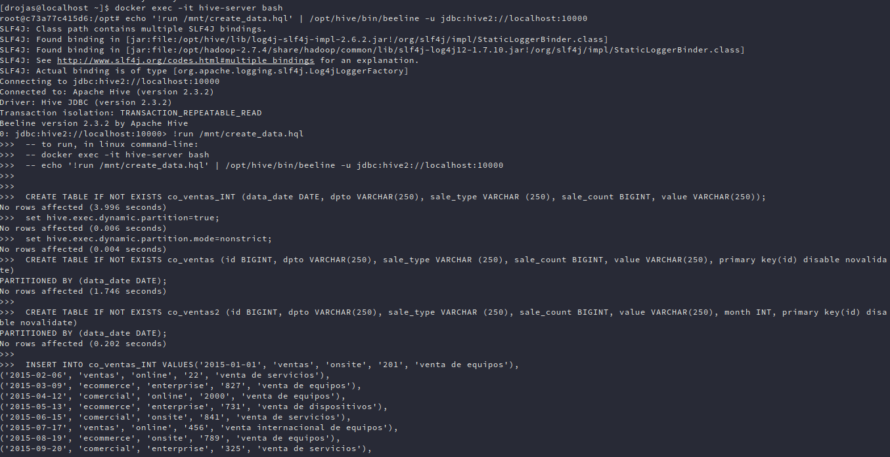
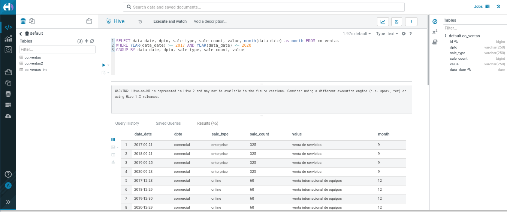
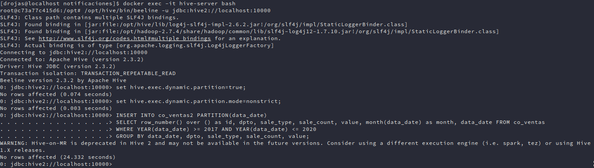
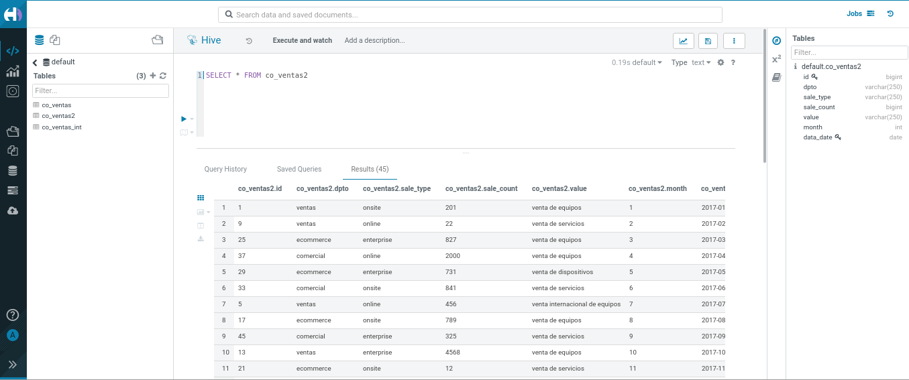

# Como ejecutar:

En el archivo `docker-compose.yml` está definido el montaje de la carpeta `init_hive` por lo cual el script `create_data.hql` se encuentra montado en el container, por lo cual la creación de las tablas y los insert se realizan ejecutando el archivo `create_data.hql`.

Primero iniciar una sesión de bash del container de `hive-server`:

```shell
docker exec -it hive-server bash
```

Ya adentro del container, correr el siguiente comando:
```shell
echo '!run /mnt/create_data.hql' | /opt/hive/bin/beeline -u jdbc:hive2://localhost:10000
```

# Resultados
A. Resultados de la ejecución del script `create_data.hql`:



Resultados de la ejecución de la query del punto 1 - a`:



B. Resultados de la ejecución de la inserción dado el resultado de la query anterior del punto 1 - a`:



Resultado de la ejecución de un `SELECT` de la inserción anterior:

